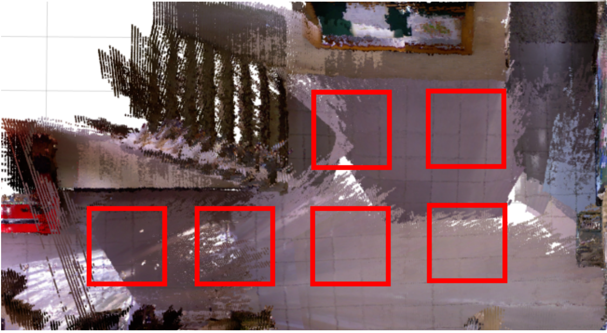

# **CPS (The Camera Position System)**

## Description

CPS (The Camera Position System) applies trained B-CNN model to provide users with real-time service. Users need to take pictures as testing data. Then, CPS discards pixels randomly to simulate training point cloud data, normalize pixels to reduce the noise produced by random environments, and sent data into the Tensorflow interpreter. Finally, CPS predict the location according to testing set of pictures with user-friendly interface.


***

## Prerequisites

+ Xcode version 11.6

***

## Key Point

+ **Segue**

```objc
-(void)prepareForSegue:(UIStoryboardSegue *)segue sender:(id)sender{
    if(imageView_1.image && imageView_2.image){
        MySecondView *controller =(MySecondView *)segue.destinationViewController; UIImage* merge=[self mergeImage];
        CVPixelBufferRef pixelBuffer = [self imageToRGBPixelBuffer:[self normalize:merge]]; CFRetain(pixelBuffer);
        //put data into runModelOnFrame
        [self runModelOnFrame:pixelBuffer];
        CFRelease(pixelBuffer);
        // set up data which has the top testing value and transmit into MySecondView 
        NSString* Text_1 = [[NSString alloc] initWithFormat:@"%d", firstlabel]; controller.content_1 =Text_1;
    }
}
```

+ **Data Normalization**

```objc
- (UIImage*)normalize:(UIImage*)image{
    for (int i = 0; i < pixelNum; i++, pCurPtr++){
        // pixel B
        ptr1 =(ptr1 -103.94)*0.017; 
        if(ptr1<=0.5)   ptr1=0;
        else if(0.5<ptr1&&ptr1<1.5) ptr1=1;
        else if(1.5<=ptr1&&ptr1<=2.5)   ptr1=2;
        else    ptr1=3;
        // pixel G
        ptr2 =(ptr2 -116.78)*0.017;
        if(ptr2<=0.5)   ptr2=0;
        else if(0.5<ptr2&&ptr2<1.5) ptr2=1;
        else if(1.5<=ptr2&&ptr2<=2.5)   ptr2=2;
        else    ptr2=3;
        // pixel R
        ptr3 =(ptr3 -123.68)*0.017;
        if(ptr3<=0.5)   ptr3=0;
        else if(0.5<ptr3&&ptr3<1.5) ptr3=1;
        else if(1.5<=ptr3&&ptr3<=2.5)   ptr3=2;
        else    ptr3=3;
    }
}
```

+ **runModelOnFrame**

```objc
- (void)runModelOnFrame:(CVPixelBufferRef)pixelBuffer {
    //setup input and output
    int input = interpreter->inputs()[0];
    TfLiteTensor *input_tensor = interpreter->tensor(input); float* out = interpreter->typed_tensor<float>(input);
    //Invoke interpreter
    if (interpreter->Invoke() != kTfLiteOk) LOG(FATAL) << "Failed to invoke!";
    //get testing data
    float* output = interpreter->typed_output_tensor<float>(0);
    //get the top value from the testing data
    GetTopN(output, output_size, kNumResults, kThreshold, &top_results); NSMutableDictionary* newValues = [NSMutableDictionary dictionary]; for (const auto& result : top_results) {
    const float confidence = result.first;
    NSString* labelObject = [NSString stringWithUTF8String:labels[index].c_str()]; NSNumber* valueObject = [NSNumber numberWithFloat:confidence]; [newValues setObject:valueObject forKey:labelObject];
    }
}
```

***

## Flowchart


***

## Demo

+ Demo Environment
  + The environment contains six recognition areas. Below is the top view picture generated by the open-source software RTAB-Map.



+ Demo Video
  + By providing tow photos of continuous vision at one testing area, CPS will point out the user’s position on the map.

[](https://drive.google.com/file/d/1LGRuJsA-jR51jpUwZw695J9G2o3ogRd4/view?usp=sharing)

***

## Publication
[[1] Y.-H. Chen, Y.-Y. Chen, M.-C. Chen, and C.-W. Huang, “3DVPS: A 3D Point Cloud-Based Visual Positioning System,” in IEEE International Conference on Consumer Electronics, Las Vegas, USA, 2020.](https://ieeexplore.ieee.org/abstract/document/9043071)